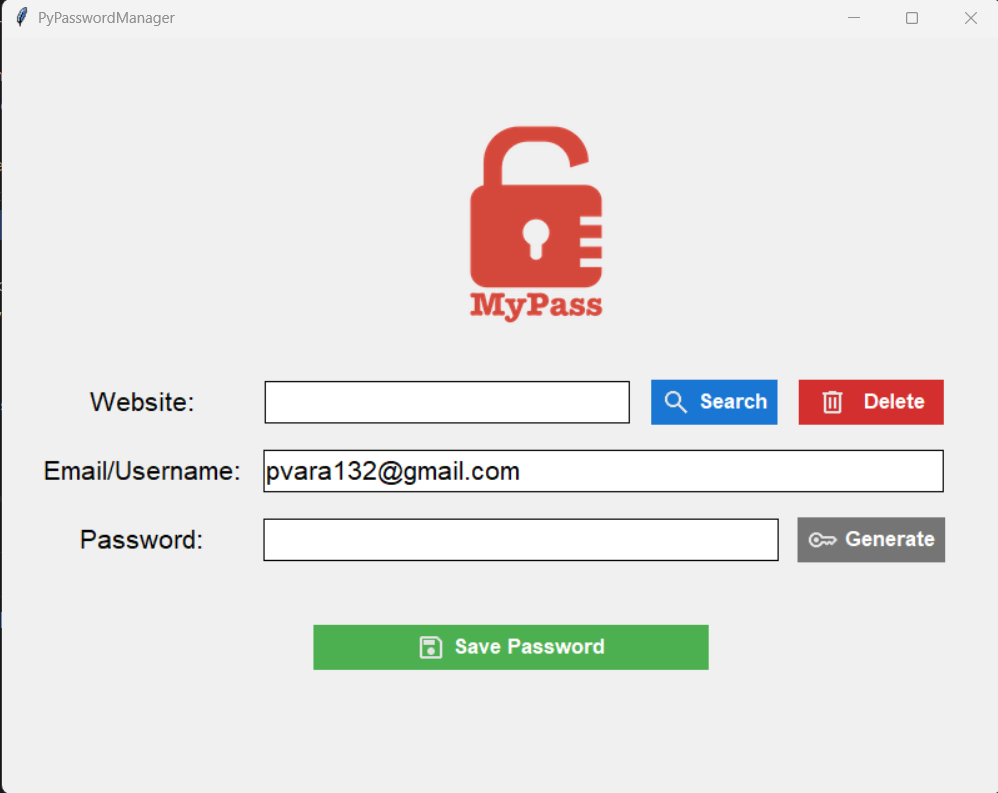

# 🔐 MyPass Password Manager

A secure desktop password manager built with **Python** and **Tkinter**.

MyPass allows you to securely store, search, update, and delete credentials using an encrypted local vault protected by a master password.

---

## ✨ Features

- 🔑 Master Password Authentication
- 🔒 Master password hashing with **bcrypt**
- 🔐 Password vault encryption using **Fernet**
- 🛡️ Encryption key derived using **PBKDF2-HMAC-SHA256**
- 💾 Secure encrypted password vault
- 🔍 Search saved credentials
- ➕ Save new credentials
- ✏️ Update existing credentials
- 🗑️ Delete saved credentials
- 🎲 Secure password generator
- 📋 Copy generated passwords to clipboard
- 🎨 Modern Tkinter UI with icons
- 🧩 Modular project architecture

---

## 📸 Screenshot



---

## 🏗️ Project Structure

```text
MyPass/
│
├── auth.py
├── crypto_utils.py
├── generator.py
├── storage.py
├── ui.py
├── main.py
│
├── data/
│   └── vault.dat
│
├── assets/
│
└── README.md
```

---

## 🚀 Installation

Clone the repository:

```bash
git clone https://github.com/vardhon/PyPasswordManager.git
```

Navigate into the project:

```bash
cd PyPasswordManager
```

Install dependencies:

```bash
pip install -r requirements.txt
```

Run the application:

```bash
python main.py
```

---

## 🔑 First Launch

On the first launch, you'll be prompted to create a **Master Password**.

The application automatically creates the required secure storage files.

Sensitive files such as your encrypted vault and master password hash should be excluded from version control using `.gitignore`.

---

## 🔒 Security

- Master passwords are **hashed using bcrypt**.
- Encryption keys are derived using **PBKDF2-HMAC-SHA256**.
- Passwords are encrypted using **Fernet** before being written to disk.
- Credentials are stored in the encrypted `vault.dat` file.
- Passwords are **never stored in plain text**.

---

## 🛠️ Technologies Used

- Python 3
- Tkinter
- bcrypt
- cryptography
- JSON
- pyperclip

---

## 🚀 Future Improvements

- 👁️ Show / Hide password
- 🔄 Change master password
- 🧂 Random salt generation
- 📊 Password strength indicator
- 🌙 Dark mode
- ☁️ Cloud synchronization

---

## 📄 License

This project is licensed under the **MIT License**.